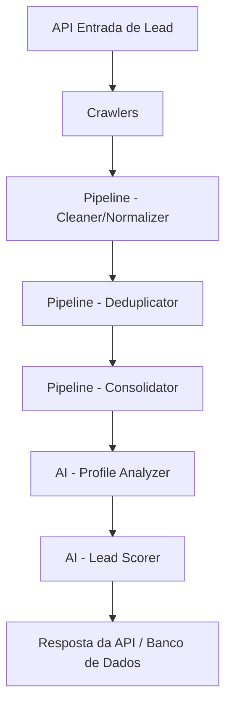

# Arquitetura Onion Byte

## Visão Geral

O projeto **Onion Byte** é uma API de enriquecimento de leads e análise preditiva.
Ele recebe dados brutos de leads, utiliza *crawlers* para buscar mais dados em fontes públicas (Google, Receita Federal, Reclame Aqui),
processa essas informações em um pipeline de normalização e desduplicação, e por fim utiliza Agentes de IA para pontuar (Scoring) o lead.

## Fluxo de Dados

## Componentes

1. **Crawlers**: Componentes assíncronos que raspam dados públicos (BeautifulSoup, Aiohttp).
2. **Data Pipeline**: Limpeza, formatação e consolidação dos dados coletados.
3. **AI Agents**: Analisa as informações de texto para extrair features latentes e calcular um Score (0-100) com base no Perfil Ideal de Cliente (ICP).
